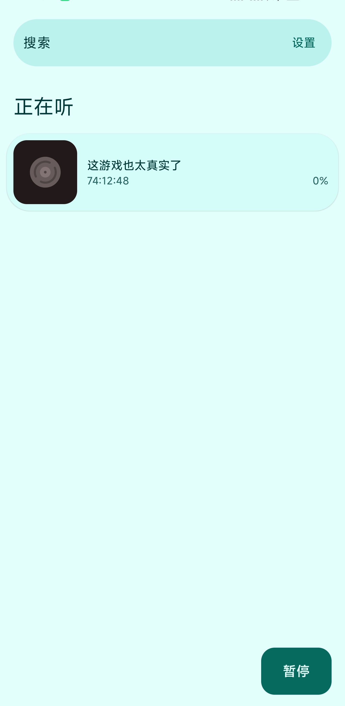
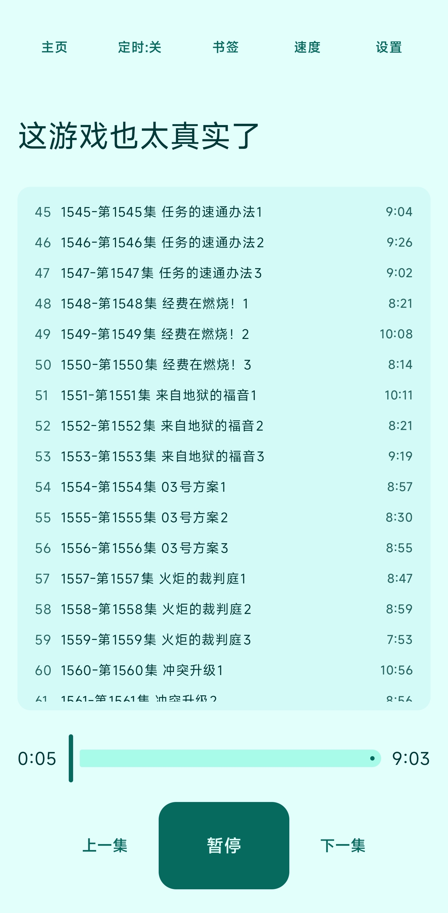
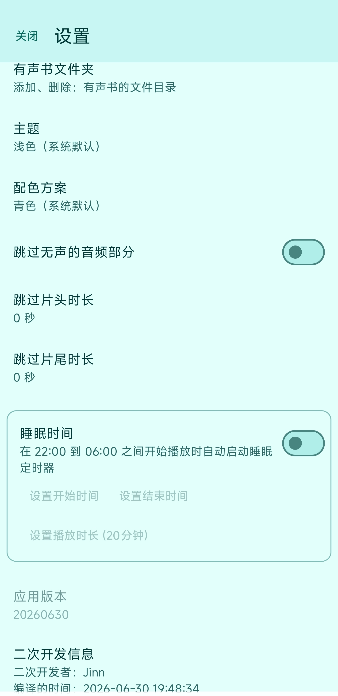
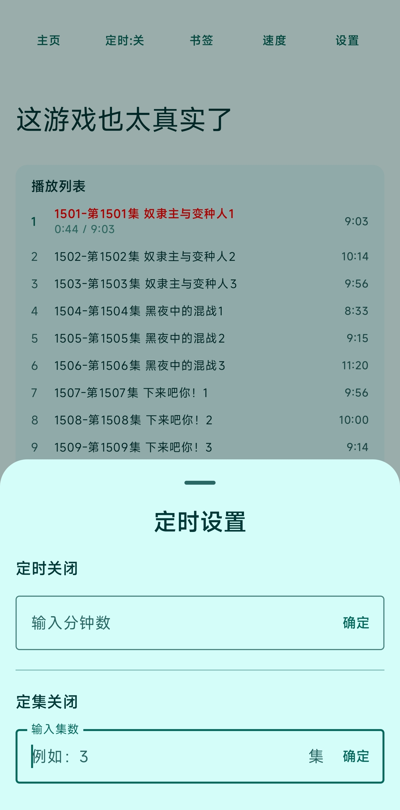
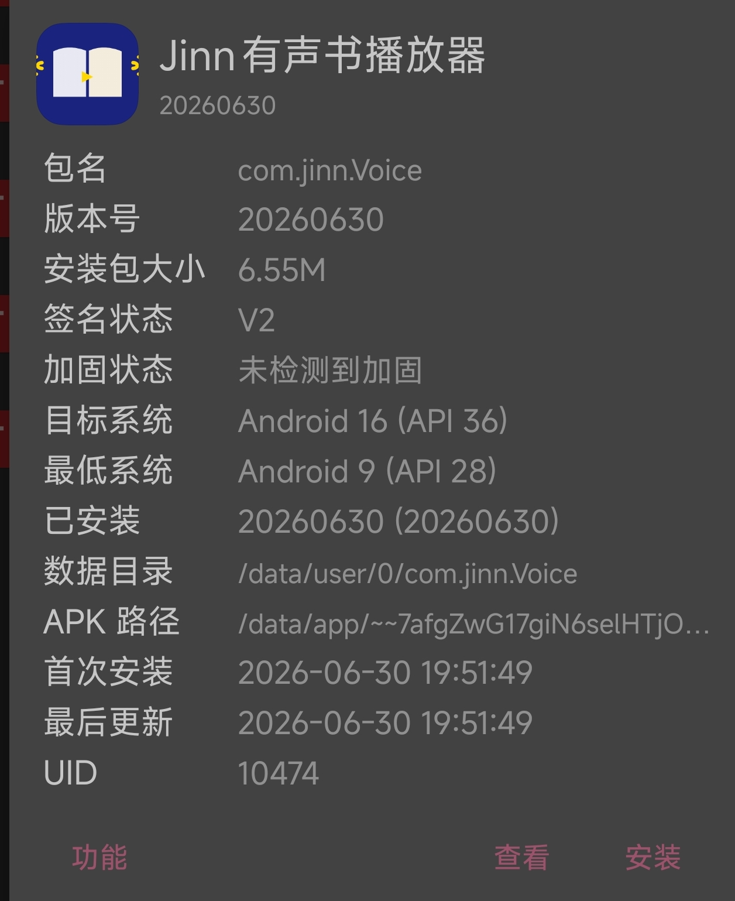

# Jinn有声书播放器

[](LICENSE.md)
[](https://developer.android.com)
[]()
[](https://github.com/yezijinn/voice-player-zh-localized/releases)
[]()

一款面向中文听书场景的 Android 有声书播放器。它保留了原始 Voice 项目的稳定基础，同时补齐了更适合中文用户的界面与常用播放能力，包括定时停止、定集停止、跳过片头片尾、书签和桌面小部件。


## 主要能力

| 功能 | 说明 |
|------|------|
| 中文界面 | 全站中文本地化，适合直接上手 |
| 定时关闭 | 支持按时间停止播放 |
| 定集停止 | 播放到指定集数后自动停止 |
| 关闭软件 | 定时后可以自动关闭软件 |
| 跳过片头片尾 | 可自定义片头、片尾跳过时长 |
| 书签 | 记录并快速回到播放位置 |
| 主题 | 支持多种主题配色 |
| 桌面小部件 | 快速控制播放状态 |

## 截图展示

| 欢迎页面 | 应用主页 |
|:---:|:---:|
|  |  |

| 播放页面 | 设置页面 |
|:---:|:---:|
|  |  |

| 定时功能 | 关于 |
|:---:|:---:|
|  |  |

## 安装与编译

### 下载安装包

直接到 Releases 页面下载最新安装包：<https://github.com/yezijinn/voice-player-zh-localized/releases>

### 本地编译

如果需要自行编译或二次修改，请把项目依赖放到 `tools/` 目录，然后运行：

```bash
python 一键打包.py
```

脚本会把完整编译日志写入根目录的 `build.log`，编译成功后自动生成可安装 APK。

## 📥 下载安装

### 方式一：下载预编译 APK

在 [Releases](https://github.com/yezijinn/voice-player-zh-localized/releases) 页面下载最新 APK 文件，直接安装到手机即可使用。

### 方式二：自行编译

如果你想自己修改代码或定制功能，可以按照以下步骤编译。

#### 1. 下载编译环境

项目需要以下依赖，**请按顺序下载并解压到项目根目录的 `tools/` 文件夹**：

| 依赖 | 版本 | 下载链接 | 解压后目录 |
|------|------|----------|------------|
| JDK | 25.0.3 | [OpenJDK 25 (解压密码: openweb)`](https://github.com/adoptium/temurin25-binaries/releases/download/jdk-25.0.3%2B9/OpenJDK25U-jdk_x64_windows_hotspot_25.0.3_9.zip) | `tools/jdk/` |
| Gradle | 9.6.1 | [Gradle 9.6.1](https://services.gradle.org/distributions/gradle-9.6.1-all.zip) | `tools/gradle/` |
| Android SDK | API 37 | [Android SDK 命令行工具](https://dl.google.com/android/repository/commandlinetools-win-11076708_latest.zip) + [platforms/android-37](https://dl.google.com/android/repository/platform-37_r02.zip) + [build-tools/37.0.0](https://dl.google.com/android/repository/build-tools_r37.zip) | `tools/android-sdk/` |

**详细安装步骤：**

```bash
# 1. 进入项目目录
cd voice-player-zh-localized

# 2. 创建 tools 目录（如果不存在）
mkdir tools

# 3. 下载并解压 JDK 25
# 下载链接: https://github.com/adoptium/temurin25-binaries/releases/download/jdk-25.0.3%2B9/OpenJDK25U-jdk_x64_windows_hotspot_25.0.3_9.zip
# 解压后将文件夹重命名为 jdk，放入 tools 目录
# 最终路径: tools/jdk/bin/java.exe

# 4. 下载并解压 Gradle 9.6.1
# 下载链接: https://services.gradle.org/distributions/gradle-9.6.1-all.zip
# 解压后将文件夹重命名为 gradle，放入 tools 目录
# 最终路径: tools/gradle/bin/gradle.bat

# 5. 下载并配置 Android SDK
# 5.1 下载命令行工具: https://dl.google.com/android/repository/commandlinetools-win-11076708_latest.zip
# 5.2 解压到 tools/android-sdk/cmdline-tools/
# 5.3 重命名文件夹为 latest
# 5.4 使用 sdkmanager 安装平台:
#     tools\android-sdk\cmdline-tools\latest\bin\sdkmanager.bat "platforms;android-37" "build-tools;37.0.0"

# 6. 创建 local.properties（让项目能找到 Android SDK）
# 在项目根目录创建文件 local.properties，内容如下：
# sdk.dir=D:\path\to\voice-player-zh-localized\tools\android-sdk
```

> ⚠️ **重要**：请确保解压后的目录结构正确：
> - `tools/jdk/bin/java.exe` ← JDK 可执行文件
> - `tools/gradle/bin/gradle.bat` ← Gradle 可执行文件
> - `tools/android-sdk/platforms/android-37/android.jar` ← Android 平台库

#### 2. 运行编译

环境配置完成后，执行一键打包：

```bash
python 一键打包.py
```

首次运行会下载必要的 Gradle 组件（大约 100-200MB），请耐心等待。

编译成功后，APK 文件会生成在项目根目录。

---

## 🔧 首次编译 - 生成签名密钥

Android 应用安装到手机时需要数字签名，否则无法安装。首次编译需要生成一个签名密钥（相当于你的数字身份证）。

#### 1. 生成签名密钥

打开命令提示符（CMD）或 PowerShell，进入项目目录后执行：

```bash
# 生成签名密钥
# 请把下面的 "你的密码" 替换成你自己设置的密码（至少6位）
# alias（别名）可以改成你喜欢的名字，比如 yourname 或 myapp
keytool.exe -genkeypair -v -keystore signing.jks -alias 你的别名 -keyalg RSA -keysize 2048 -validity 10000 -storepass 你的密码 -keypass 你的密码 -dname "CN=你的名字, OU=Development, O=YourName, L=City, ST=State, C=CN"
```

**参数说明：**
- `signing.jks` - 生成的密钥文件名，可以改成你喜欢的名字
- `你的别名` - 密钥的别名（建议用字母或数字，不要用中文）
- `你的密码` - 你自己设置的密码（两次密码保持一致）
- `你的名字` - 填你的名字或昵称

执行后会在当前目录生成一个 `signing.jks` 文件，这就是你的签名密钥。

#### 2. 配置签名信息

在项目根目录创建签名配置文件（或者直接修改 `Voice-main/signing/signing.properties`）：

```bash
# Windows 系统
echo STORE_PASSWORD=你的密码 > signing.properties
echo KEY_ALIAS=你的别名 >> signing.properties
echo KEY_PASSWORD=你的密码 >> signing.properties
```

#### 3. 重新编译

配置完成后，重新运行编译命令：

```bash
python 一键打包.py
```

编译成功的 APK 已经使用你的签名，可以直接安装到手机。

---

⚠️ **重要提示**：
- **请务必备份你的签名密钥文件**（`signing.jks`）和密码！丢失后将无法生成相同签名的更新包
- 如果你使用其他名字作为别名或密钥文件，编译命令中的配置也要相应修改

---

## 🏗️ 项目结构

```
Voice-main/
├── app/                    # 主应用模块
├── core/                   # 核心模块
│   ├── common/            # 通用工具
│   ├── data/              # 数据层 (Room数据库)
│   ├── playback/          # 播放引擎 (ExoPlayer)
│   ├── scanner/           # 媒体文件扫描
│   ├── search/            # 搜索功能
│   ├── sleeptimer/        # 定时功能
│   └── ui/                # UI组件
├── features/               # 功能模块
│   ├── bookOverview/      # 书籍列表
│   ├── bookmark/          # 书签
│   ├── playbackScreen/    # 播放界面
│   ├── settings/          # 设置
│   ├── sleepTimer/        # 定时设置
│   └── widget/            # 桌面小部件
└── signing/                # 签名配置
```

---

## 🛠️ 技术栈

- **语言**：Kotlin
- **UI框架**：Jetpack Compose
- **架构**：MVVM + Clean Architecture
- **依赖注入**：Metro (Dagger)
- **数据库**：Room
- **媒体播放**：ExoPlayer (Media3)
- **构建工具**：Gradle 9.6.1

---

## 📚 文档

- [自定义修改UI指南](自定义修改UI指南.md) - 如何自定义界面
- [开发文档](开发文档.md) - 开发环境搭建和核心功能实现

---

## 🤝 贡献

欢迎提交 Issue 和 Pull Request！

---

## 📄 许可证

本项目基于 [GPL-3.0](LICENSE.md) 许可证开源。

---

## 💖 致谢

- 原始项目：[Voice](https://github.com/PaulWoitaschek/Voice) by Paul Woitaschek
- 感谢所有开源贡献者

---

**如果你喜欢这个项目，请点个 ⭐ Star 支持一下！**